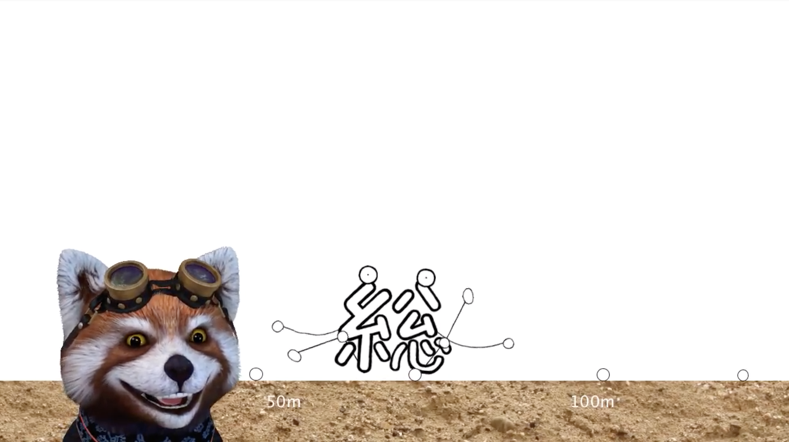

# 総コンくんマラソン
明大祭2017、｢Sokon Next Amusement Park｣展示のアクションゲーム

## ダウンロード

- [明大祭2日目ver](https://github.com/TokiwaTools/sokon_sokonkun-qwop/releases/tag/1.0)

## 対応環境

- Windows 32/64bit
- macOS
- Linux 32/64bit

## ルール
- 総コンくんの脚を操作して走行距離を競う
- 手が地面についたらゲームオーバー
- 3回プレイして最も走行距離の長い記録が採用される
- 走行距離に応じてもらえるコインの数が変動

## 操作方法
- Q: 股を閉じる
- W: 股を開く
- O: 足を閉じる
- P: 足を開く

## 素材提供
https://hhh316.deviantart.com/art/Rough-Sand-Texture-Seamless-347828772
